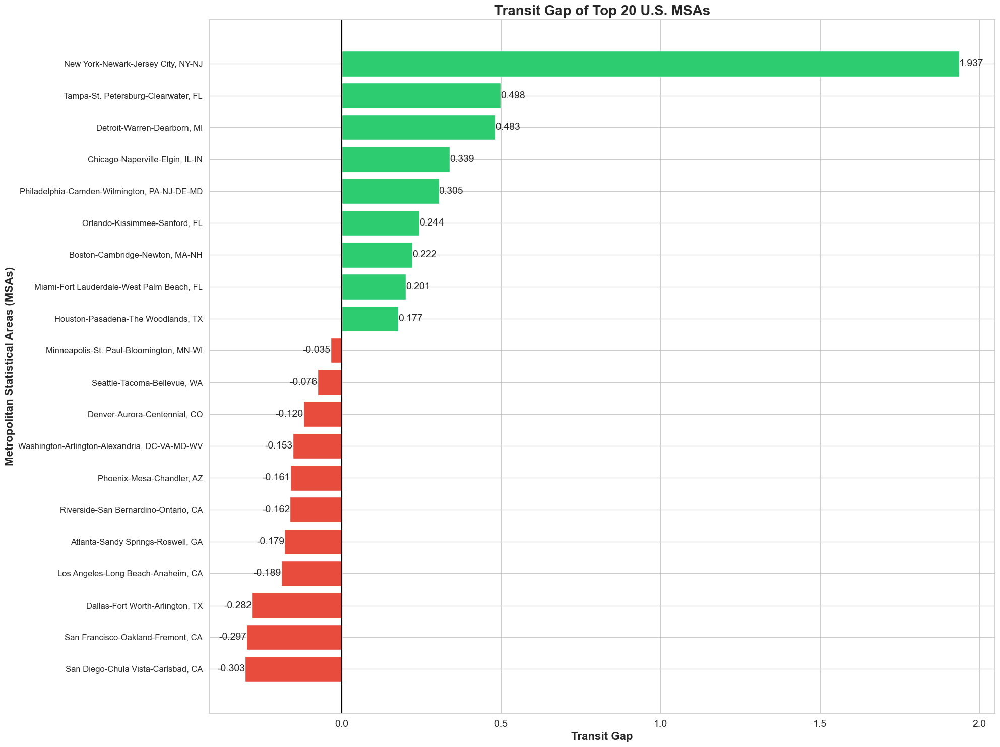
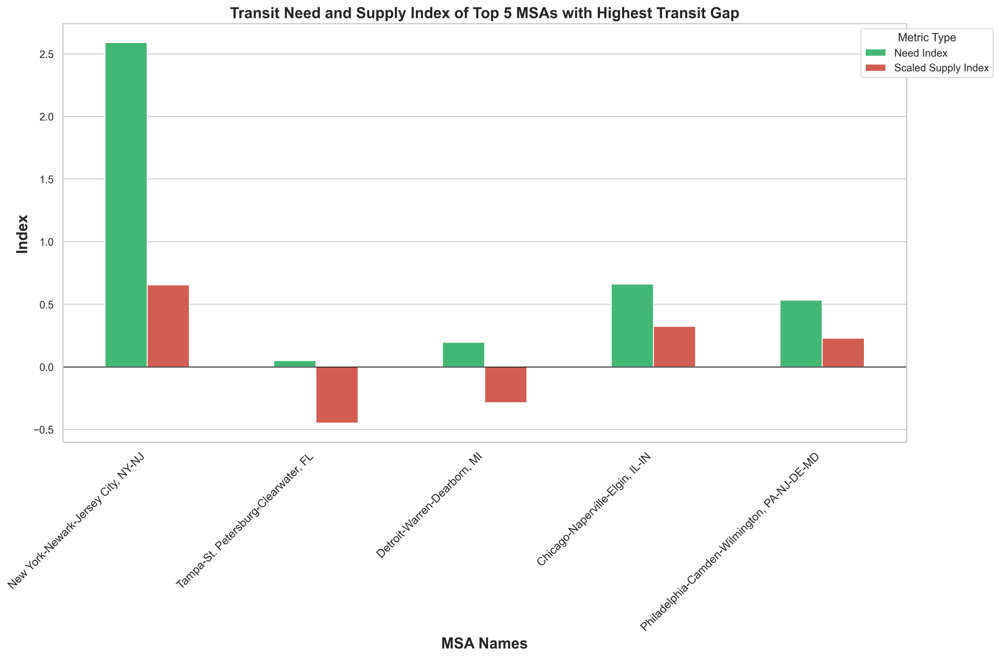
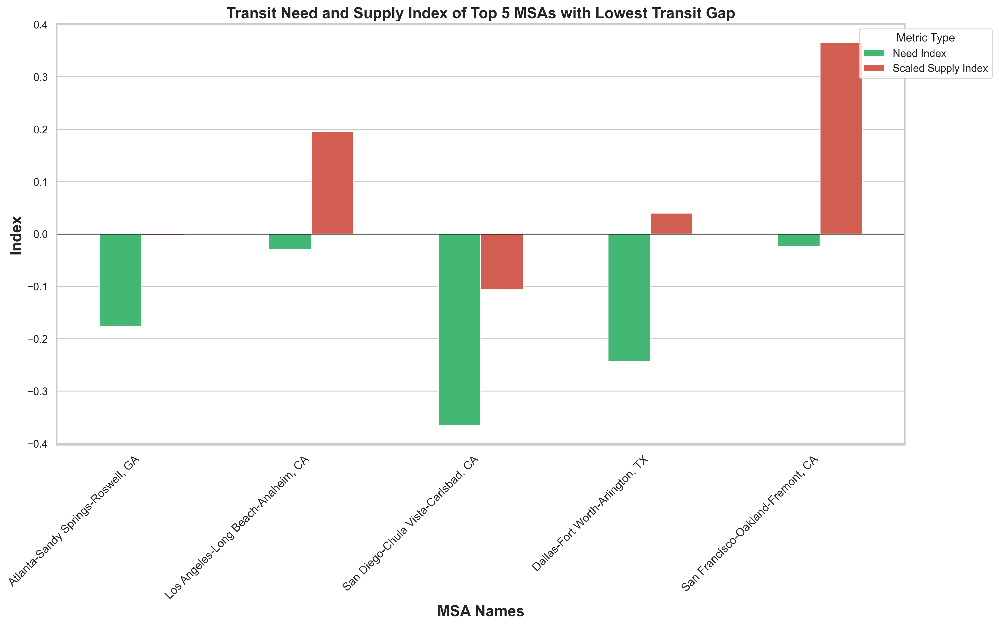
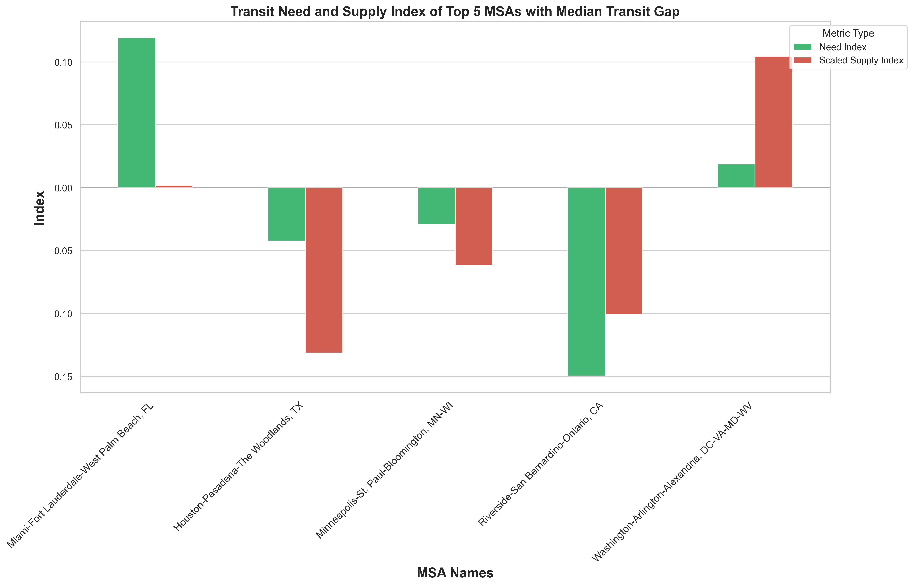
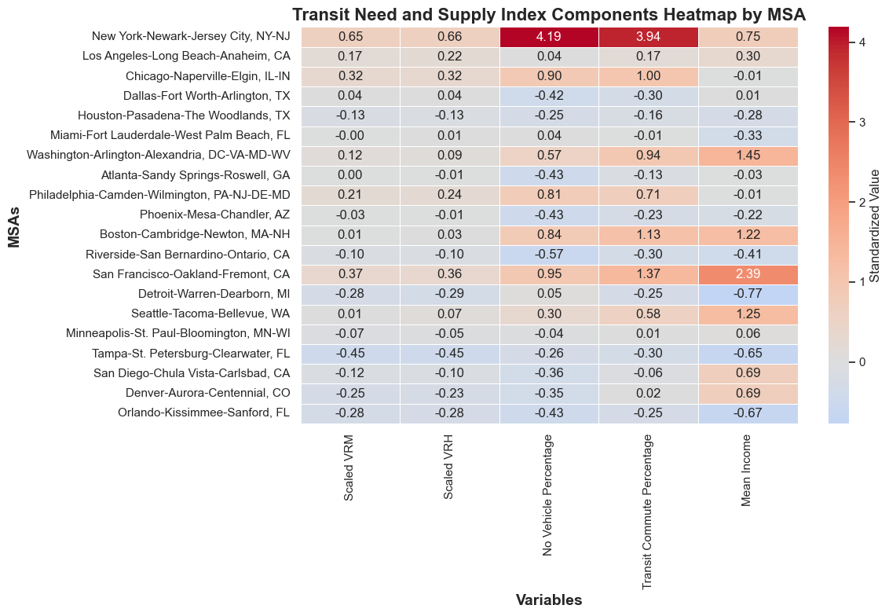
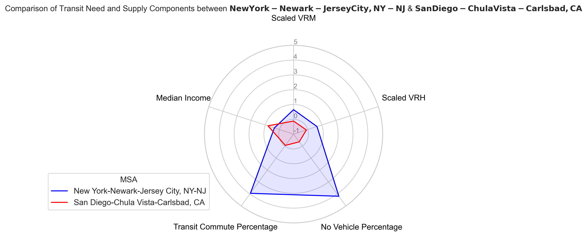
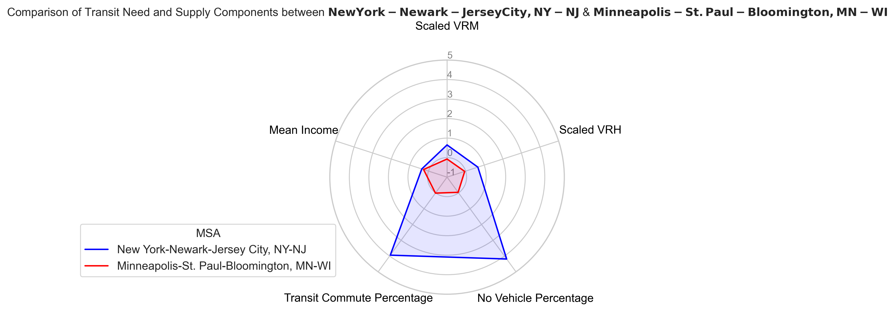
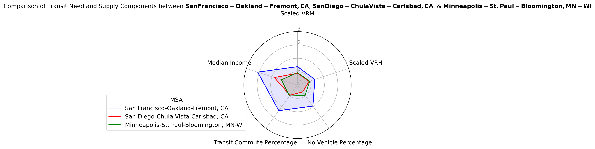

# A Comparative Analysis of Public Transit Need and Supply in the 20 Largest U.S. Metropolitan Statistical Areas (MSAs)

## I. Abstract
This project presents a comparative analysis of public transit need and supply across the 20 largest U.S. Metropolitan Statistical Areas (MSAs). Transit need is assessed using socioeconomic indicators—median household income, vehicle availability, and the share of workers commuting by public transit—to construct a **Transit Need Index**. Transit service is measured through per-capita Vehicle Revenue Miles (VRM) and Vehicle Revenue Hours (VRH) from the National Transit Database, aggregated from Urbanized Areas (UZAs) to the MSA level to form a **Transit Supply Index**. Both indices are standardized using **robust z-scores** to reduce the influence of extreme values, such as those observed in the New York–Newark–Jersey City metropolitan area. The difference between these indices, defined as the **Transit Gap**, identifies MSAs where transit service does not fully align with population need. Results reveal three distinct typologies of metropolitan transit systems: (1) **Need-Dominant Systems** (e.g., New York, Chicago), where high population dependence exceeds even extensive transit provision; (2) **Affluence-Dominant Systems** (e.g., San Diego, Dallas), where high median incomes and widespread vehicle access result in a relative surplus of transit; and (3) **Balanced / Representative Systems** (e.g., Minneapolis, Denver), where service provision closely aligns with socioeconomic need. These findings indicate that strategies to address transit gaps must consider the underlying dependence and demographic characteristics of each metropolitan area.

## II. Motivation & Background
Public transportation plays a critical role in urban mobility in the United States, supporting billions of passenger trips each year and providing essential access to employment, education, and services—particularly for households without reliable access to private vehicles. Ensuring that transit service is aligned with underlying need remains an important challenge for large metropolitan regions.

In practice, the distribution of public transit service across metropolitan areas does not always reflect socioeconomic indicators of transit dependence, such as income, vehicle availability, and commuting patterns. Comparing transit need and supply is further complicated by fragmented data structures: measures of transit demand are typically reported at the metropolitan level, while transit service metrics
are reported at the urbanized area level. This project is motivated by the need for a transparent, data-driven framework to compare public transit need and supply across major U.S. metropolitan statistical areas.

  
## III. Unit of Analysis
The primary unit of analysis is the **Metropolitan Statistical Area**.
This project focuses on the **20 largest U.S. MSAs by total population**.

Transit *need* indicators are calculated directly at the MSA level using
United States Census Bureau - American Community Survey (ACS) data.

Transit *supply* indicators are derived from the National Transit Database (NTD),
which reports service statistics at the **Urbanized Area (UZA)** level.
To reconcile this mismatch, UZA-level transit service metrics were **rescaled**
to the MSA level using population proportions.

Population normalization for transit supply metrics uses the
**Service Area Population (`service_area_pop`)** reported in the NTD,
rather than total metropolitan population, to more accurately reflect
the population served by each transit agency.

## IV. Variable Definitions and Rationale

This project uses a set of socioeconomic and transit service indicators to quantify public transit **need** and **supply** across metropolitan areas. Each variable was selected to capture a distinct dimension of transit dependence or service provision.

### 1. Median Household Income

**Definition:** Median household income represents the median income of households within a metropolitan area, reported in inflation-adjusted dollars.

**Rationale:** Income is a key determinant of transportation choice. Lower-income households are more likely to depend on public transit due to limited access to private vehicles and higher sensitivity to transportation costs. In the Transit Need Index, income is **inverted** so that lower income corresponds to higher transit need.
 

### 2. Public Transit Commute Percentage

**Definition:** Public transit commute percentage represents the share of workers who commute to work using public transportation.

**Rationale:** This variable directly reflects **existing reliance on transit** for daily mobility. Higher transit commute shares indicate greater dependence on transit infrastructure and a higher potential need for sustained or expanded service.
 

### 3. Percentage of Households with No Vehicle Available

**Definition:** The percentage of households reporting no access to a private vehicle.

**Rationale:** Households without vehicles are structurally dependent on alternative transportation modes. This indicator captures **transportation vulnerability** and unmet mobility needs, making it one of the strongest predictors of transit dependence.
 

### 4. Vehicle Revenue Miles (VRM) per Capita

**Definition:** Vehicle Revenue Miles (VRM) represent the total distance traveled by transit vehicles while in revenue service (i.e., when passengers are permitted to board).

**Why per capita?** VRM is divided by population to account for differences in metropolitan size and to enable fair comparison across MSAs.

**Rationale:** VRM per capita captures the **spatial availability and coverage** of transit service. Higher values indicate more extensive service relative to population, reflecting greater potential access to transit across the metropolitan area.
 

### 5. Vehicle Revenue Hours (VRH) per Capita

**Definition:** Vehicle Revenue Hours (VRH) measure the total time transit vehicles spend in revenue service.

**Why per capita?** Normalizing VRH by population controls for metropolitan scale and allows comparison of service intensity across regions.

**Rationale:** VRH per capita reflects **service frequency and operational intensity**, capturing how much transit service is supplied relative to population size.
 

### Summary

Together, these variables capture complementary dimensions of public transit systems:

- **Transit Need:** Income, vehicle availability, and commuting behavior  
- **Transit Supply:** VRM per capita, VRH per capita  

By combining these indicators into standardized indices, this project provides a transparent framework for identifying mismatches between transit need and transit supply across major U.S. metropolitan areas.
 

## V. Methodology

### 0. Data Processing and Harmonization

To ensure consistency across datasets, several preprocessing steps were applied to both transit service and census data.

#### 0.1 Census Data (Need)

Transit need indicators were derived from the **2024 American Community Survey (ACS) 1-year estimates**, using **Subject Tables**.

Data were filtered to include all **Metropolitan Statistical Areas (MSAs)** within the United States and Puerto Rico.

Key preprocessing steps included:
- Sort Top 20 MSAs by total population for analysis.
- **Percentage of households with no vehicle available** was calculated as:

$$
\text{Pct No Vehicle} = \frac{\text{Households with No Vehicle}}{\text{Total Households}}
$$

using raw ACS data from [acs_vehicle_ownership_2024.csv](data/raw/census/acs_vehicle_ownership_2024.csv) and stored in [top20_transit_need.csv](data/cleaned-unmerged/top20_transit_need.csv).
- **Public transit share** was calculated as:

$$
\text{Public Transit Share}
= \frac{\text{Transit Commuters}}{\text{Total Workers}}
$$

where both **Transit Commuters** and **Total Workers** were obtained from [acs_means_of_transport_to_work_2024.csv](data/raw/census/acs_means_of_transport_to_work_2024.csv).  
The unstandardized transit commute share was exported to [top20_transit_need.csv](data/cleaned-unmerged/top20_transit_need.csv) and later merged into the finalized dataset used for index construction.

- **Median household income** was sourced directly from ACS income subject tables.

***

#### 0.2 Transit Service Data (Supply)

Transit service data from the National Transit Database (NTD) were filtered to include only:

- **Report Year:** 2024  
- **Time Period:** Annual Total  
- **Type of Service:** Directly Operated (DO) & Purchased Transportation (PT) public transportation  

The following modes were excluded to focus on fixed-route and high-capacity transit services:
- **Vanpool**
- **Demand Response**

Transit agencies were first aggregated at the **Urbanized Area (UZA)** level.

Because transit service metrics are reported at the UZA level while transit need indicators are reported at the Metropolitan Statistical Area (MSA) level, UZA-level service metrics were rescaled to the MSA level using population-based weighting. _UZA to MSA mapping file can be found at [uza_to_msa.csv](data/raw/transportation/output/uza_to_msa.csv)_.

Per-capita transit supply was then calculated using the NTD-reported **Service Area Population (`service_area_pop`)**.

Additional preprocessing steps included:
- Manual harmonization of **four-digit UZA (UACE) codes** for the Boston and Atlanta regions to match records in the raw NTD service dataset.
- Exporting the cleaned transit service dataset to [transit_supply.csv](data/cleaned-unmerged/transit_supply.csv).
---

### 1. Transit Need Index

Transit need was approximated using three socioeconomic and travel-related indicators:

- Percentage of households with no vehicle available  
- Percentage of workers commuting via public transit  
- Median household income (inverted to reflect higher need at lower incomes)

Each variable was standardized using a **robust z-score** based on the median and interquartile range (IQR).

The final **Transit Need Index** was calculated as the unweighted mean of the standardized variables:

$$
\text{Transit Need Index}
= \frac{Z_{\text{noVehicle}} + Z_{\text{transitCommute}} - Z_{\text{income}}}{3}
$$

#### Why Robust Z-Score Standardization?
All index components were standardized using **robust z-scores**, which are calculated based on the median and interquartile range (IQR) rather than the mean and standard deviation. This approach reduces the influence of extreme outliers, such as New York’s exceptionally high transit dependence metrics, ensuring that the indices reflect relative differences across MSAs without being skewed by extreme values.

---

### 2. Transit Supply Index

Transit supply was measured using the following National Transit Database service metrics:

- **Vehicle Revenue Miles (VRM) per capita**
- **Vehicle Revenue Hours (VRH) per capita**

All variables were standardized using the same robust z-score approach applied to the Transit Need Index.

After standardization, for each MSA, transit supply metrics were estimated as the population-weighted sum of overlapping UZAs:

$$
S_{MSA} = \sum_{u \in MSA} S_u \times \frac{P_{u \cap MSA}}{P_u}
$$

where:
- $S_u$ is the UZA-level transit service metric (VRM or VRH),
- $P_u$ is the total population of UZA $u$,
- $P_{u \cap MSA}$ is the population of UZA $u$ within the MSA boundary,
- $S_{MSA}$ is the estimated transit service for the MSA.

The final **Transit Supply Index** was calculated as the unweighted mean of the scaled and standardized variables:

$$
\text{Transit Supply Index}
= \frac{Z_{\text{VRM per capita}} + Z_{\text{VRH per capita}}}{2}
$$

---

### 3. Transit Need–Supply Gap

The **Transit Gap** metric was defined as the difference between the Transit Need Index and the Transit Supply Index:

$$
\text{Transit Gap} = \text{Transit Need Index} - \text{Transit Supply Index}
$$

Positive values indicate MSAs where transit need exceeds transit supply, while negative values indicate relatively higher levels of transit provision.

## VI. Key Findings

_For all databases used to calculate standardized values and finalized database [folder](data/processed)_

### 1. Macroscopic Analysis of Transit Gaps

***Figure 1:** Transit Gap of Top 20 U.S. MSAs*

**Figure 1** illustrates the distribution of transit disparities across the cohort.
  - **Service Deficits (Positive Gap):** 9 of the 20 MSAs exhibit a positive gap, indicating that their socioeconomic transit dependence exceeds their relative level of service provision. This group is dominated by "legacy" transit cities with high population density.
  - **Service Availability (Negative Gap):** 11 of the 20 MSAs exhibit a negative gap. This indicates Supply-Dominance, where service levels are high relative to the socioeconomic dependence of the population (often driven by higher median incomes or high vehicle ownership rates).

---

### 2. Component Analysis: Drivers of the Gap
To understand the source of these gaps, we decompose the metric into its two constituent indices: **Transit Need** (Green) and **Transit Supply** (Red).

#### 2.1. High-Gap MSAs: The "Need-Driven" Deficit
- **Observation:** In the top 5 highest-gap MSAs (e.g., **New York, Chicago, Philadelphia**), the disparity is driven almost entirely by the **Need Index (Green Bar)**.
- **Key Insight:** New York–Newark–Jersey City (NY-NJ) is the most extreme example. Despite having a positive Supply Index (indicating above-average service), its Need Index is astronomically high (>2.5 standard deviations).
- **Interpretation:** This suggests that for these dense, urbanized regions, even robust transit systems are struggling to keep pace with the extreme transit dependence of their populations. The "deficit" here is not a failure of supply, but a reflection of intense demand.

***Figure 2:** Top 5 MSAs with Highest Transit Gap*

#### 2.2. Low-Gap MSAs: The "Affluence-Driven" Surplus
- **Observation:** The MSAs with the lowest (most negative) gaps, such as **San Diego** and **Dallas**, display a distinct pattern: their **Need Index (Green Bar) is deeply negative**.
- **Key Insight:** San Diego–Chula Vista–Carlsbad (CA) has a Need Index of roughly -0.4.
- **Interpretation:** A negative Need Index implies high median income and high vehicle ownership. The "surplus" (negative gap) in these Sunbelt cities is not caused by having "too much" transit (oversupply), but rather by having a population that is structurally less dependent on it. Their transit infrastructure, while moderate, exceeds the relatively low socioeconomic demand.

***Figure 3:** Top 5 MSAs with Lowest Transit Gap*

#### 2.3. Median-Gap MSAs: The Representative Baseline
- **Observation:** The MSAs in the median range (e.g., **Minneapolis, Seattle**) show minimal divergence between need and supply.
- **Key Insight: Minneapolis–St. Paul–Bloomington** is the most statistically representative case. Its Need Index and Supply Index bars are both negligible (hovering near 0.0).
- **Interpretation:** Unlike the outliers, Minneapolis represents the cohort average. It does not suffer from the extreme inequality of New York, nor does it possess the low-dependency characteristics of San Diego. It is a "balanced" system where service provision closely mirrors the socioeconomic profile of its residents.

***Figure 4:** 5 MSAs in the median range*

---

### 3. Structural Drivers (Heatmap Analysis)

***Figure 5:** Heatmap for Top 20 MSAs*

The heatmap further clarifies the specific variables driving these indices:
- **Supply Uniformity:** The **Scaled VRM** and **Scaled VRH** metrics are relatively uniform across most MSAs (light colors), suggesting that transit supply is fairly standardized across major U.S. cities when adjusted for population, with the exception of New York and San Francisco.
- **Need Variance:** The true differentiator is **Transit Need**.
  - **New York** is the sole outlier for _Transit Commute Percentage_ and _No Vehicle Percentage_ (deep red). New York’s Z-scores for these metrics (>3.9) skew the entire dataset, distinguishing it structurally from all other U.S. cities.
  - **San Francisco** and **Washington D.C.** show high _Median Income_ (orange/red), which mathematically suppresses their Need Index, despite their high transit ridership.
 
---

### 4. Comparative Case Studies
#### 4.1. **The Extremes (New York vs. San Diego)**
Comparing the highest-gap MSA (New York) with the lowest-gap MSA (San Diego):
- **Visual Contrast:** As illustrated in the radar chart, New York–Newark–Jersey City (blue line) completely dominates San Diego–Chula Vista–Carlsbad (red line) across all transit-dependency metrics. New York exhibits vastly higher _Transit Commute Percentage_ and _No Vehicle Percentage_, alongside higher per-capita supply (VRM/VRH).
- **The Income Inversion:** The only metric where San Diego surpasses New York is **Median Income**. This structural difference highlights the divergence in transit function: New York’s system supports a population with high "captivity" (low car ownership), whereas San Diego’s system operates in an environment of high vehicle access and affluence, resulting in a negative "Need" index despite moderate supply.

***Figure 6:** New York vs. San Diego*

#### 4.2. **The Outlier vs. The Median** **(New York vs. Minneapolis)** 
Comparing New York (Highest Gap) with Minneapolis (Median Gap):
- As shown in the radar charts, New York's polygon completely envelops Minneapolis's across need-based metrics.
- **The "Representative" MSA:** Minneapolis–St. Paul acts as the statistical baseline for this cohort. Its radar chart forms a nearly perfect symmetrical pentagon, and its Z-scores across all five metrics are effectively zero. This indicates that Minneapolis represents the **average profile** of a top-20 U.S. MSA: balanced deviations between supply and need.

***Figure 7:** New York vs. Minneapolis*

#### 4.3. **The Negative Gap Drivers (San Diego & San Francisco)** 
Comparing San Diego & San Francisco (Lowest Gap) with Minneapolis (Median Gap):
- San Diego’s and San Francisco's negative gap is driven primarily by Median Income.
- While San Diego and San Francisco have comparable supply metrics to the median, their higher household income significantly reduces their calculated "Need" score.
- This highlights a limitation of the model—in wealthier regions, transit need is not driven by lack of vehicles (captivity) but potentially by choice (lifestyle/traffic), which this socioeconomic "Need Index" does not fully capture.

***Figure 8**: San Diego & San Francisco vs. Minneapolis*

---

### 5. Conclusion
This comparative analysis of the 20 largest U.S. Metropolitan Statistical Areas (MSAs) reveals that the "Transit Gap" is driven less by variations in service supply and more by extreme divergences in socioeconomic transit dependence.

Three distinct typologies of metropolitan transit systems emerge from the data:

1. **Need-Dominant Systems (e.g., New York, Chicago):** These regions face a **"Density Dilemma."** They possess the highest levels of transit supply in the nation, yet they still exhibit the largest service gaps. This paradox occurs because their populations are structurally dependent on transit (low car ownership, high ridership) to a degree that outpaces even extensive infrastructure. For these MSAs, "closing the gap" requires not just maintaining current service, but exponentially increasing capacity to meet non-linear demand.

2. **Affluence-Dominant Systems (e.g., San Diego, Dallas):** These regions exhibit a statistical "surplus" of transit, but this is a function of demographics rather than infrastructure. With high median incomes and near-universal vehicle access, their calculated "Need" is low. The challenge in these Sunbelt MSAs is not necessarily satisfying basic mobility needs, but rather **inducing demand**—shifting discretionary travelers from private vehicles to public transit to achieve sustainability goals.
3. **Balanced / Representative Systems (e.g., Minneapolis, Denver):** These MSAs represent the statistical "mean" of the top 20 cohort. Their service levels are commensurate with their socioeconomic profiles, suggesting a stable equilibrium. However, this equilibrium may also indicate a "middle-income trap," where transit service is adequate for the current user base but insufficient to catalyze a shift away from car dependency.

## VII. Limitations

This project is subject to several data and methodological limitations.

- First, transit service metrics are reported by the National Transit Database at the **Urbanized Area (UZA)** level, while transit need indicators from the American Community Survey are reported at the **Metropolitan Statistical Area (MSA)** level. To reconcile this mismatch, UZA-level transit supply metrics were rescaled to the MSA level using population-based weighting. While this approach is commonly used in spatial analysis, it assumes that transit service is distributed proportionally to population within each UZA and does not capture intra-metropolitan variations in service intensity.

- Second, per-capita transit supply was calculated using the NTD-reported **Service Area Population**, which may differ from total MSA population counts. As a result, per-capita measures may not fully reflect differences in service coverage or accessibility across metropolitan regions.

- Third, although ACS data at the **Urbanized Area (UZA)** level exist, the most recent available UZA-level ACS estimates are from **2020**. Using these data would introduce a substantial temporal mismatch with the 2024 transit service data used in this project. As a result, UZA-level ACS datasets were not used, and transit need was evaluated at the MSA level instead.

- Finally, the constructed Transit Need Index and Transit Supply Index use **equal weighting** across all component variables. While this approach ensures transparency and interpretability, it does not account for potential differences in the relative importance of individual indicators, which could influence index values.

These limitations should be considered when interpreting the results, and future research could address them by incorporating more recent small-area data, alternative weighting schemes, or longitudinal analysis.

## VIII. Data Sources
This project uses publicly available datasets from the United States Census Bureau and the Federal Transit Administration.    
### 1. United States Census Bureau
- [Table B01003: Total Population - Census Bureau Table](https://data.census.gov/table/ACSDT1Y2024.B01003?q=B01003&g=010XX00US$3140000&moe=false)
- [Table B08301: Means of Transportation to Work](https://data.census.gov/table/ACSDT1Y2024.B08301?q=B08301:+Means+of+Transportation+to+Work&moe=false)
- [Table B08201: Household Size by Vehicles Available](https://data.census.gov/table/ACSDT1Y2024.B08201?q=b08201&g=010XX00US$31000M1&moe=false)
- [Table S1903: Median Income in the Past 12 Months (in 2024 Inflation-Adjusted Dollars)](https://data.census.gov/table/ACSST1Y2024.S1903?q=S1903&g=010XX00US$31000M1&moe=false)
- [Metropolitan Statistical Areas (MSA) References Files](https://www.census.gov/geographies/reference-files/time-series/demo/metro-micro/delineation-files.html)

### 2. Federal Transit Administration
- [National Transit Dataset - Service (by Mode and Time Period)](https://catalog.data.gov/dataset/service-flat-file)
- [Annual Database Agency Information](https://www.transit.dot.gov/ntd/data-product/2024-annual-database-agency-information)

## IX. Authors
Dung Tri Nguyen (Dune Nguyen)  
Minh Kiet Tran (Charles Tran)  
